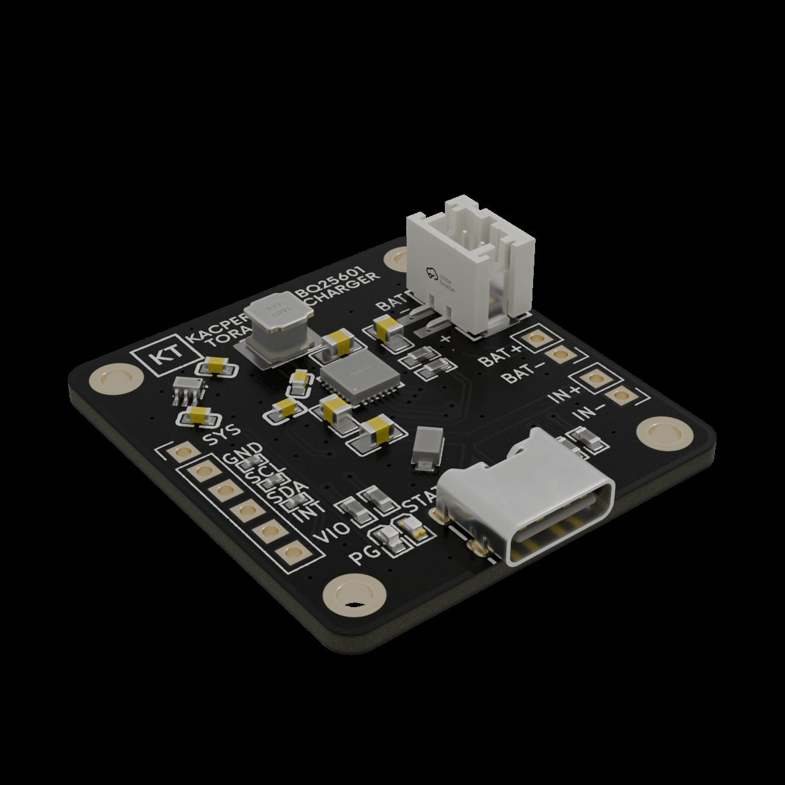

# KT_BQ25601
Arduino and PlatformIO library for Texas Instruments BQ25601 I2C battery charger.

  

The library was tested with this BQ25601 Module that I made.

## Documentation & References

This driver was implemented using official Texas Instruments documentation:
* [TI BQ25601 Datasheet (HTML)](https://www.ti.com/document-viewer/bq25601/datasheet)